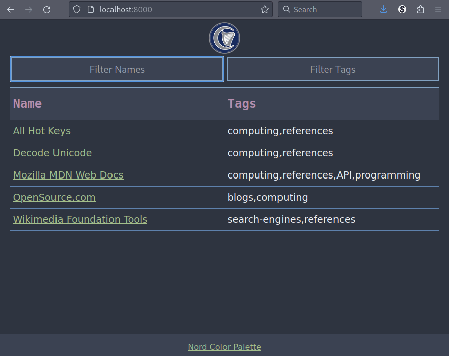

# simple-homepage

HTML, CSS, and Javascript self-hostable homepage using a JSON list backend.



## Requirements

Only a working web server and javascript enabled browser.

## Setup and testing

An easy way to setup and test locally is to use something like the builtin python http server.

After installing python the following can be used inside the repo directory to run a local webserver for testing:

```Bash
# defaults to http://localhost:8000
python3 -m http.server
```

Otherwise, setup on a full web server is normal and can be done to your wanting.

Note that the site cannot be run via the `file://` protocol due to default browser security settings.

## Using `links.json`

Content consists of a list of dictionaries in which each dictionary and the two keys are both read to make the content table.

An example `links.json`:

```json
[
	{"name": "OpenSource.com", "url": "https://opensource.com", "tags": ["blogs", "computing"]},
    {"name": "Wikimedia Foundation Tools", "url": "https://foundation.wikimedia.org/wiki/Home", "tags": ["search-engines", "references"]}
]
```

The keys 'name', 'url', and 'tags' are expected in the formats shown above.

